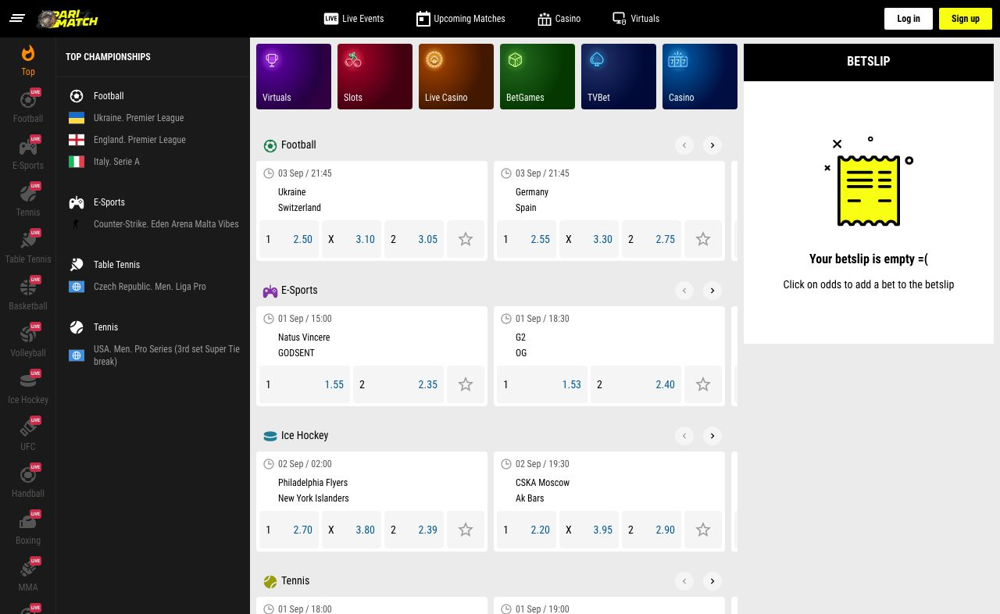

Report example:

<html lang="en" dir="ltr">
<head>
<meta charset="utf-8">

<link rel="stylesheet" href="../test-data/report.css">

</head>
<body>
<h3>Performance test COM desktop stage Tue Sep 01 2020 13:36:19 GMT+0300</h3>

<h4>Open main page</h4>

<table>
    <tr>
        <td>Events count</td>
        <td>69</td>
        <td>69</td>
        <td>69</td>
        <td>68</td>
        <td>68</td>
    </tr>
</table>
<table>
    <tr>
        <td>performance</td>
        <td>0.05</td>
        <td>0.05</td>
        <td>0.05</td>
        <td>0.05</td>
        <td>0.05</td>
    </tr>
    <tr>
        <td>accessibility</td>
        <td>0.66</td>
        <td>0.66</td>
        <td>0.66</td>
        <td>0.66</td>
        <td>0.66</td>
    </tr>
    <tr>
        <td>seo</td>
        <td>0.91</td>
        <td>0.91</td>
        <td>0.91</td>
        <td>0.91</td>
        <td>0.91</td>
    </tr>
</table>
<table>
    <tr>
        <td>firstContentfulPaint</td>
        <td>5.5 s</td>
        <td>5.4 s</td>
        <td>5.6 s</td>
        <td>5.5 s</td>
        <td>5.5 s</td>
    </tr>
    <tr>
        <td>totalBlockingTime</td>
        <td>16,760 ms</td>
        <td>16,080 ms</td>
        <td>19,510 ms</td>
        <td>16,560 ms</td>
        <td>16,130 ms</td>
    </tr>
    <tr>
        <td>timeToInteractive</td>
        <td>25.5 s</td>
        <td>24.8 s</td>
        <td>28.5 s</td>
        <td>25.1 s</td>
        <td>24.5 s</td>
    </tr>
    <tr>
        <td>speedIndex</td>
        <td>8.6 s</td>
        <td>8.3 s</td>
        <td>10.0 s</td>
        <td>9.1 s</td>
        <td>9.1 s</td>
    </tr>
    <tr>
        <td>largestContentfulPaint</td>
        <td>10.9 s</td>
        <td>11.0 s</td>
        <td>11.0 s</td>
        <td>12.7 s</td>
        <td>10.5 s</td>
    </tr>
    <tr>
        <td>cumulativeLayoutShift</td>
        <td>0.057</td>
        <td>0.056</td>
        <td>0.057</td>
        <td>0.057</td>
        <td>0.057</td>
    </tr>
</table>

Lighthouse audits - average

<table>
    <tr>
        <td>firstContentfulPaint</td>
        <td>5.495</td>
    </tr>
    <tr>
        <td>totalBlockingTime</td>
        <td>17.008</td>
    </tr>
    <tr>
        <td>timeToInteractive</td>
        <td>25.686</td>
    </tr>
    <tr>
        <td>speedIndex</td>
        <td>9.037</td>
    </tr>
    <tr>
        <td>largestContentfulPaint</td>
        <td>11.206</td>
    </tr>
    <tr>
        <td>cumulativeLayoutShift</td>
        <td>0.057</td>
    </tr>
</table>

Lighthouse audits - median

<table>
    <tr>
        <td>firstContentfulPaint</td>
        <td>5.475</td>
    </tr>
    <tr>
        <td>totalBlockingTime</td>
        <td>16.558</td>
    </tr>
    <tr>
        <td>timeToInteractive</td>
        <td>25.149</td>
    </tr>
    <tr>
        <td>speedIndex</td>
        <td>9.078</td>
    </tr>
    <tr>
        <td>largestContentfulPaint</td>
        <td>10.966</td>
    </tr>
    <tr>
        <td>cumulativeLayoutShift</td>
        <td>0.057</td>
    </tr>
</table><table>
    <tr>
        <td>Time to display coefficients in viewport</td>
        <td>6.604</td>
        <td>6.758</td>
        <td>5.683</td>
        <td>6.418</td>
        <td>6.871</td>
    </tr>
</table>
<table>
    <tr>
        <td>Time to display coefficients in viewport - average</td>
        <td>6.467</td>
    </tr>
</table>
<table>
    <tr>
        <td>Time to display coefficients in viewport - mediana</td>
        <td>6.604</td>
    </tr>
</table>

</body>
</html>
